# Diagramas em Mermaid

Conforme solicitado, abaixo estão todos os diagramas mencionados na documentação técnica, escritos em sintaxe Mermaid para facilitar a visualização e entendimento técnico do sistema **ExpenseChain**.

## Sumário dos Diagramas

1. [Diagrama de Arquitetura da Aplicação](#1-diagrama-de-arquitetura-da-aplicação)
2. [Fluxograma do Fluxo de Operações](#2-fluxograma-do-fluxo-de-operações)
3. [Diagramas de Componentes](#3-diagramas-de-componentes)
   - 3.1. [Módulo de Gerenciamento de Usuários](#31-módulo-de-gerenciamento-de-usuários)
   - 3.2. [Módulo de Alocação de Cotas](#32-módulo-de-alocação-de-cotas)
   - 3.3. [Módulo de Integração com ERP](#33-módulo-de-integração-com-erp)
   - 3.4. [Módulo de Gestão de Tokens](#34-módulo-de-gestão-de-tokens)
4. [Fluxograma do Fluxo de Transações](#4-fluxograma-do-fluxo-de-transações)
5. [Diagrama das Regras de Negócio em Smart Contracts](#5-diagrama-das-regras-de-negócio-em-smart-contracts)
6. [Fluxograma do Processo de Contratação e Pagamento do Sistema](#6-fluxograma-do-processo-de-contratação-e-pagamento-do-sistema)
7. [Fluxograma do Processo de Recarga de Tokens](#7-fluxograma-do-processo-de-recarga-de-tokens)
8. [Fluxograma do Processo de Aprovação Hierárquica](#8-fluxograma-do-processo-de-aprovação-hierárquica)

---

## 1. Diagrama de Arquitetura da Aplicação

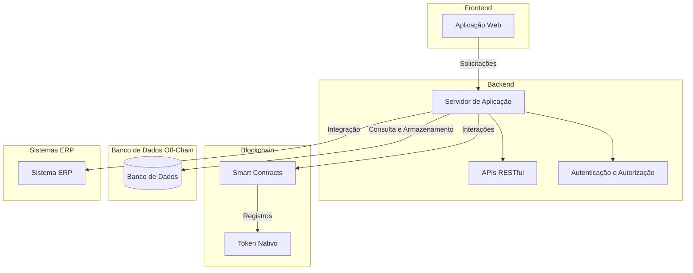

---

## 2. Fluxograma do Fluxo de Operações

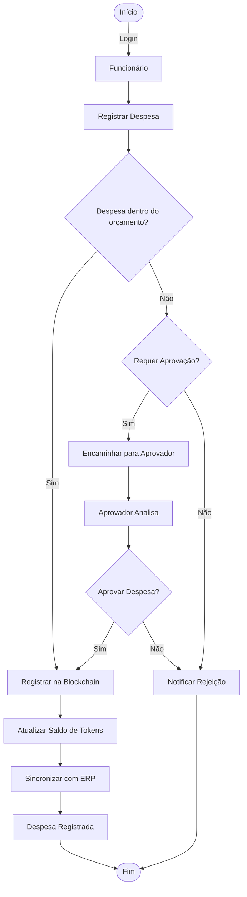

---

## 3. Diagramas de Componentes

### 3.1. Módulo de Gerenciamento de Usuários

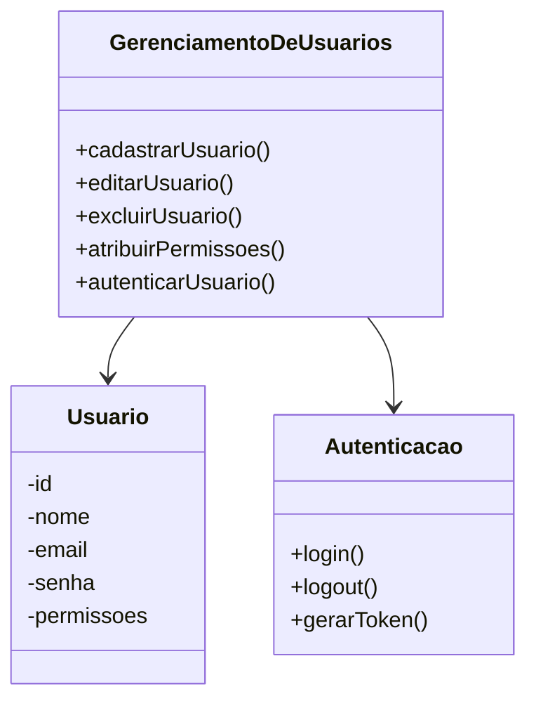

### 3.2. Módulo de Alocação de Cotas

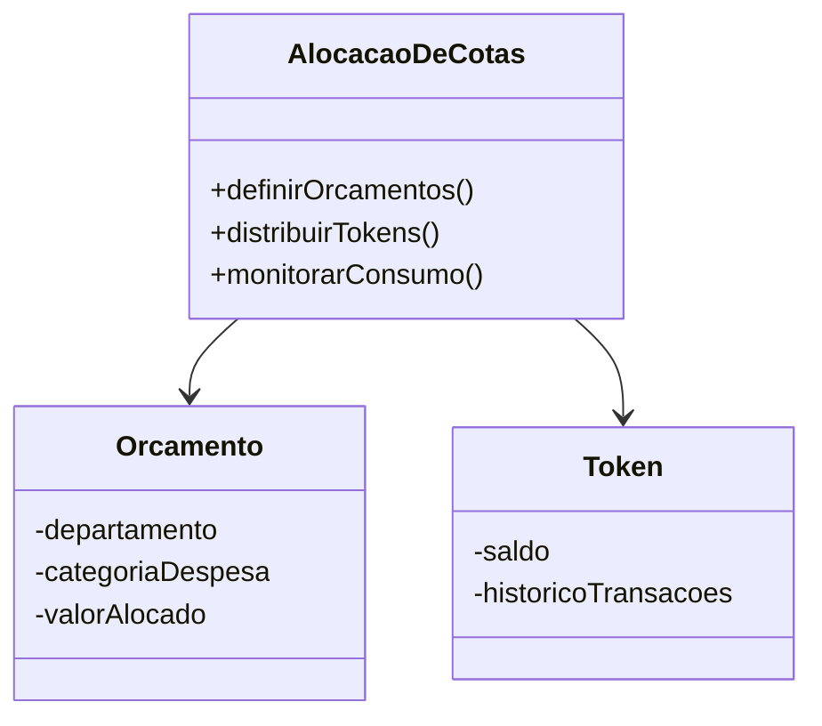

### 3.3. Módulo de Integração com ERP

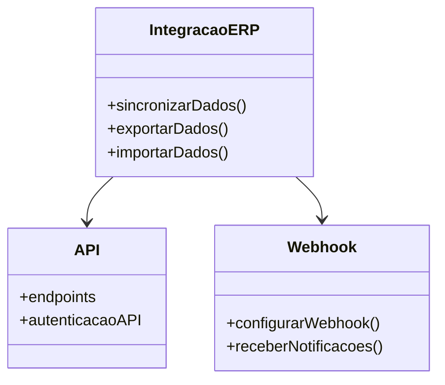

### 3.4. Módulo de Gestão de Tokens

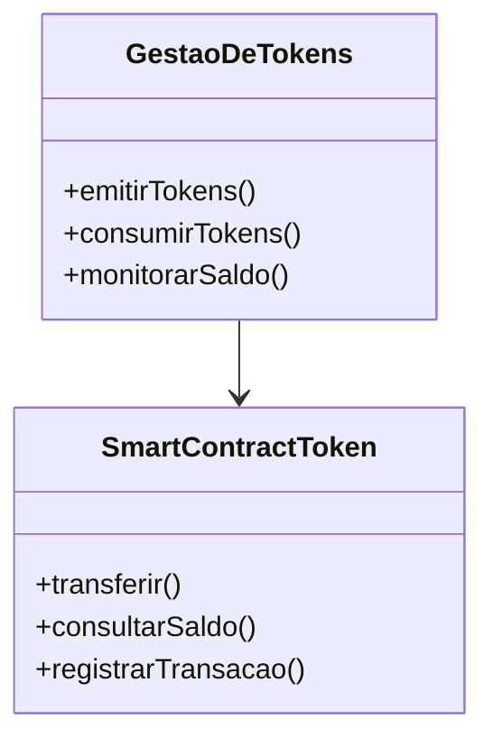

---

## 4. Fluxograma do Fluxo de Transações

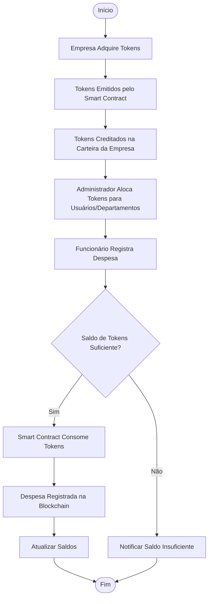

---

## 5. Diagrama das Regras de Negócio em Smart Contracts

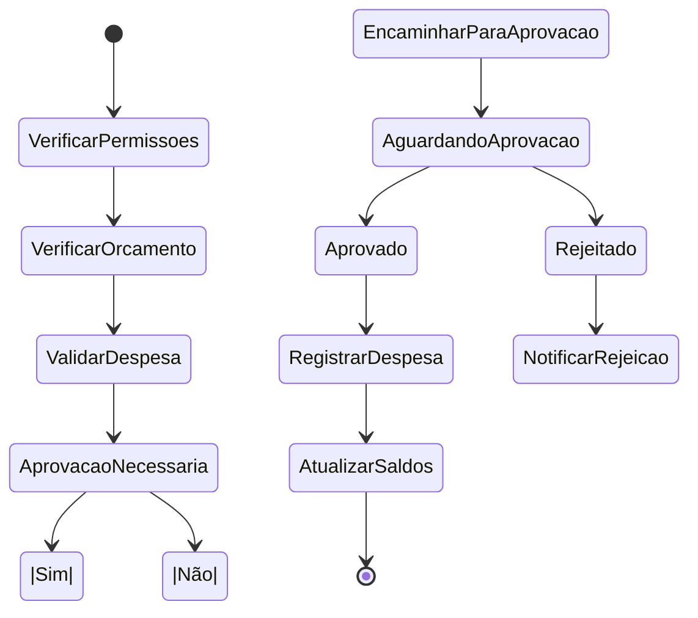

---

## 6. Fluxograma do Processo de Contratação e Pagamento do Sistema

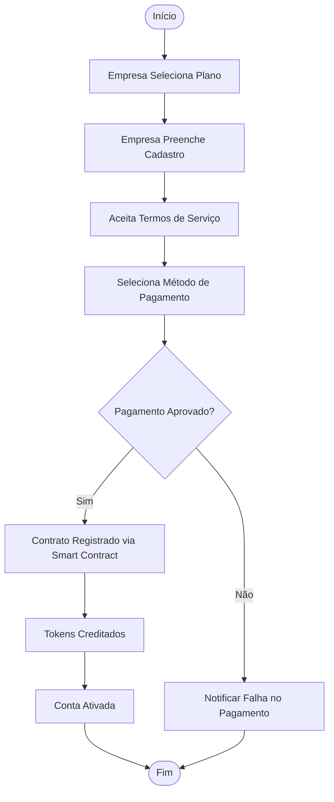

---

## 7. Fluxograma do Processo de Recarga de Tokens

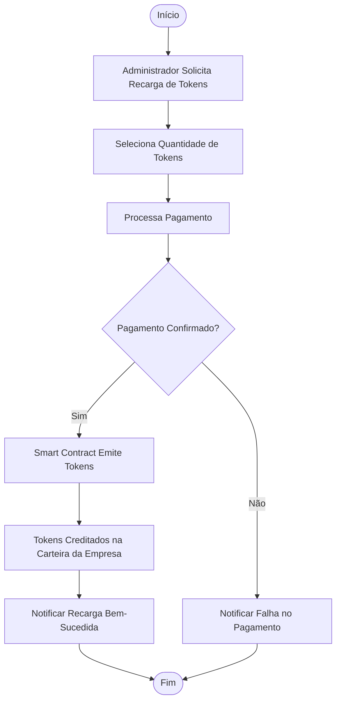

---

## 8. Fluxograma do Processo de Aprovação Hierárquica

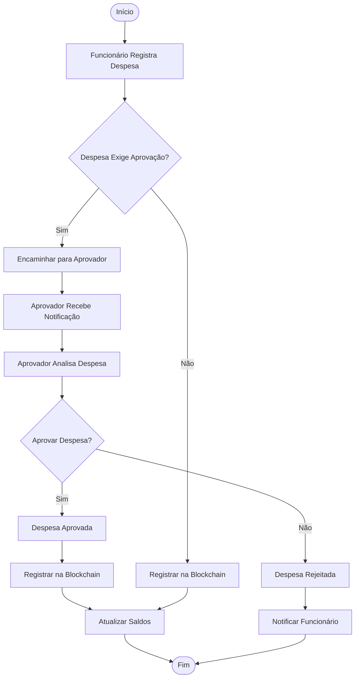
